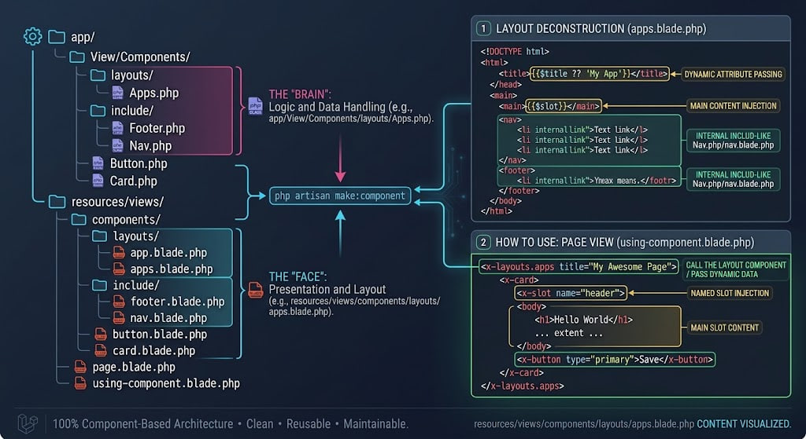

## What is a reusable layout?

A layout is a wrapper that:

- Contains repeated UI (header, navbar, footer)
- Injects page-specific content inside it

Instead of repeating this on every page 👇

```php
<nav>...</nav>
<main>PAGE CONTENT</main>
<footer>...</footer>
```

We reuse it.

Old way (Blade @extends) - quick mention

Laravel used to teach:

```php
@extends('layouts.app')
@section('content')
    <p>anything here for content</p>
@endsection

```

It still works - but componets are now preferred.

### Modern way (Blade layout components) ✅

### 1. Create a layout component

```bash
php artisan make:component Layouts/App --view
```

**This Creates📁:** `resources\views\components\layouts\apps.blade.php`

### 2. Layout component view:

```php
<!DOCTYPE html>
<html lang="en">

<head>
    <meta charset="UTF-8">
    <meta name="viewport" content="width=device-width, initial-scale=1.0">
    <title>{{$title ?? 'My App'}}</title>
</head>

<body>
    <nav>
        <a href="/">Home</a>
        <a href="/posts">Post</a>
    </nav>

    <main>
        {{$slot}}
    </main>

    <footer>
        <p>&copy; {{ date('Y') }} My App. All rights reserved.</p>
    </footer>
</body>

</html>

```

📌 $slot = Page Content

### 3. Use layout in Page

```php
<x-layouts.apps title="Home Page">

    <h2>Hello from title of post one</h2>
    <p>Hello from post one</p>

</x-layouts.apps>
```

✅💡 No `@extends, no @section, it's very clean.

\*\*Passing Data to layouts (title example)

```php
<x-layouts.apps title="Post Page">
    <h1>Posts</h1>
</x-layouts.apps>
```

Inside layout:

```php
<title>{{$title}}</title>
```

Breaking layout into smaller components (Real World)

```text
resources/views/components/
├── layouts/
│   └── app.blade.php
├── include/
│   ├── footer.blade.php
│   └── nav.blade.php
├── card.blade.php
└── button.blade.php
```



### Layout:

```php
<x-navbar/>
<main>
    {{$slot}}
</main>
<x-footer>
```

This is how real Laravel apps are structured.

Typical structure in real projects


### One Line Explaination

> A reusable layout wraps all pages and injects page content using `$slot`.

### Props vs Slots (Quic clarity)

| Feature        | Props | Slots |
| -------------- | ----- | ----- |
| Pass text/data | ✅    | ❌    |
| Pass HTML      | ❌    | ✅    |
| Simple UI      | ✅    | ❌    |
| Layout/Content | ❌    | ✅    |

### Why this better than copy-paste

| Problem            | Layout solve it |
| ------------------ | --------------- |
| Repeated HTML      | ✅              |
| Global UI Change   | ✅              |
| Cleaner Veiws      | ✅              |
| Easier maintenance | ✅              |
